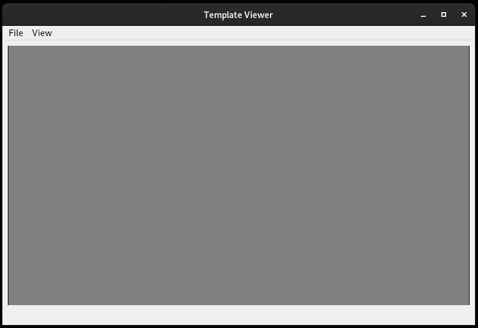
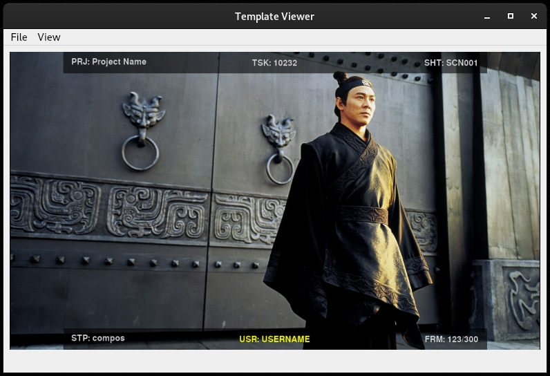
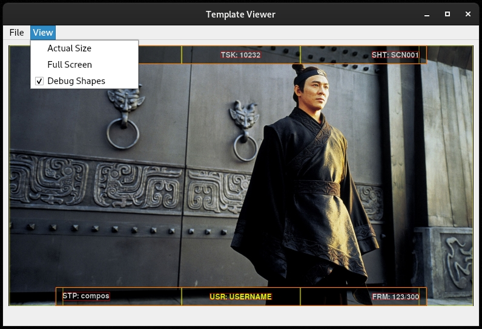

.. _viewer:

Template Viewer
---------------

Во время создания шаблона удобно использовать диалог TemplateViewer, в котором шаблон будет отображаться
и интерактивно обновляться при каждом сохранении файла.

Как использовать?
=================

Открыть диалог
**************

Для начала откройте TemplateViewer.

.. code-block:: bash

    python3 -m frame_stamp.viewer.dialog

или

.. code-block:: bash

   make run

Откроется окно вьювера.

Загрузить фон
*************

Вместо дефолтной кратинки лучше подгрузить кадр из вашего рабочего материала.
Для этого воспользуйтесь меню `File/Set Background` и укажите путь к картинке.
Либо просто перетащите файл на окно.

Кратинка всегда будет вписана в текущий размер диалога.

Создать шаблон
**************

Создать новый шаблон можно через меню `File/New Template`. Будет создан дефолтный шаблон,
который сразу откроется для редактирования.

Можно открыть имеющийся шаблон через меню `File/Set Template` или порсто перетащив его на окно.

Редактирование
**************

После определения шаблона он будет отрендерен на имеющейся картинке. При каждом сохранении файла рендер будет пересчитан.

Debug
=====

Во время разработки шаблона удобно видеть контуры форм. Особенно актуально для невидимых форм, таких как ``Grid``, ``Row`` и ``Column``.
Для включения этого режима есть два способа.

1. В шаблоне в разделе ``variables`` добавте поле ``"debug_shapes": true``

2. В меню `View/Debug Shapes`

В этом режиме каждая форма будет отрисовывать свой `bounding box` красной рамкой и `bounding box` родительского объекта жёлтой рамкой.

.. note:: Рамка родительского обекта рисуется с небольшим смещением, чтобы не совпадать с рамкой самого объекта.

.. note:: `Bounding Box` формы ``label`` может быть весьма странной. Это связанно с особенностью рендера текста. Не волнуйтесь, с ней всё ОК.

